# Welcome to GitUp!

GitUp is a portable and fast backup tool with powerful version history features that’s easy for anyone to use!

## Why GitUp?

Whether you’re writing your first software project or novel, backing up your work is essential. In the past, you might have relied on tools like Google Drive, DropBox, Carbonite, or BackBlaze to backup your work. They might give you an extra copy of your files but where did all the history that went into making them go? We learn best from our past "mistakes" and sometimes we need them back but most *back*up tools simply don’t have that functionality, that’s why we made *Git*Up. If you’ve done a bit of digging, you might have heard of something called a ‘version control system’. Most full time developers use VCSs like git to backup their work, but they are very unfriendly to new users and require a lot of time and effort to understand. There are tools like GitKraken or Gitless that claim to make using VCSs easier, but they still require you to take the time to understand how VCSs work before you can use them. Why waste time learning how to use a VCS to backup when you could just GitUp? It’s the best backup solution for you to easily compare and revert file and project history that learns from the tools of the past!

## Requirements

As of now, GitUp only works on Linux based systems. Additionally, to use GitUp, you must have a GitHub account. GitHub is a powerful hosting service for projects that back up their work using a version control system called git. You don’t need to worry about what git is! Just know that we’ll use your GitHub account to back up your work. If you don’t have a GitHub account, simply go to [https://github.com/join?source=header-home](https://github.com/join?source=header-home) and create an account!

## Download GitUp

To download GitUp quickly and easily just download our executable zip found at: [https://www.dropbox.com/sh/9jsd261dos98f6n/AABZnOT4SGWmfYVqMDnTKFSMa?dl=0](https://www.dropbox.com/sh/9jsd261dos98f6n/AABZnOT4SGWmfYVqMDnTKFSMa?dl=0)
Once downloaded you will need to unzip the contents. After unzipping, you should have a directory called GitUp. Inside this directory
you will find the GitUp executable and a git_attributes.txt file. To ensure functionality, please do not restructure this directory.

If you'd prefer to build from source, please see the "Building from Source" section at the end of this document.

## System Requirements

The only operating system GitUp currently supports is Linux. Your system will also need to have git on it. To download git onto 
your linux machine, you can find instructions for your linux distribution here: [https://git-scm.com/download/linux](https://git-scm.com/download/linux).
Other than this, there are no other requirements to run GitUp if you download our executable.

If you want to build from source, see the requirements in the "Building from Source" section at the end of this document.

# Using GitUp:

Congratulations! You now have everything you need to use GitUp. To begin, simply click on the GitUp executable file. When you do, GitUp will open and you’ll be greeted by the main menu:

## Logging in

The first thing you’ll need to do after opening GitUp is login. Simply enter your GitHub username and password where prompted and click 'Login':

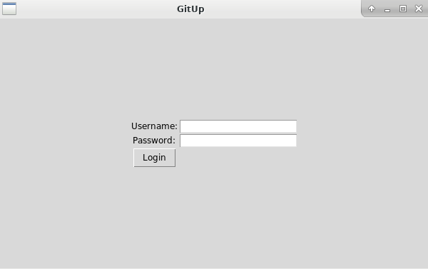

After successfully logging in you will be taken to the main menu:

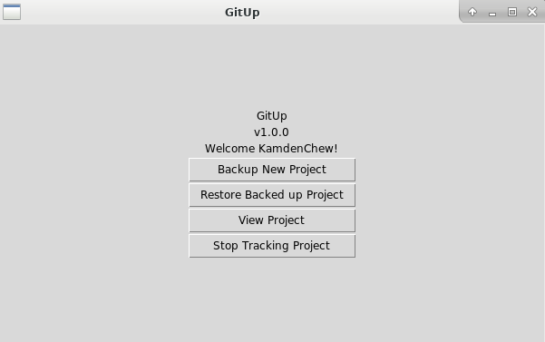

To login to your GitHub account GitUp uses a well established authorization service called OAuth which can be used to login to other services without privacy concerns.
On your first login we will create an authorization token for your account to GitUp, you can manage GitUp’s permissions at any time from your account by clicking "*Edit OAuth Settings*" on the main menu, this will redirect you to [https://github.com/settings/applications](https://github.com/settings/applications). From here click on “*Authorized OAuth Apps”* and you can remove/edit GitUp’s permissions. 

Revoking GitUp permissions from your GitHub account will stop all project backups until you login again.

## Backup A Project
To start backing up projects with GitUp simply click 'Backup New Project'. At that point, you'll be prompted to select a directory:

Once you select a directory, GitUp will automatically back up the directory if it isn't already backed up. At this point, your work is now being backed up!  GitUp will automatically attempt back up your work whenever you save a file. When choosing a project to backup,
please do not under any circumstances try to backup a directory that either contains or is a sub-directory in a project that is
already being backed up by GitUp/

## Restore a project
To add a project backed up remotely but not locally, first click on 'Add Project'. Then, you'll be greeted by the following window:

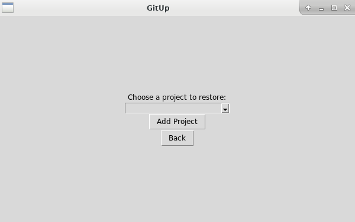

Click on the combobox to select a project to restore:

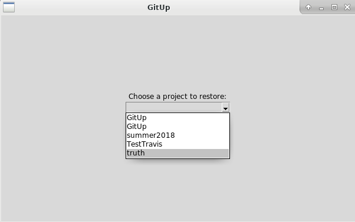

Once you've selected a project, click on 'Add Project'. Then, you'll need to select to where you want to add the project:

After the project has been added, you'll go back to the main menu. Congratulations, you now have successfully added the backed up project to your local machine! Please do not any circumstances attempt to restore a project inside a project that GitUp is already tracking!

## View A Project
If you want to view a GitUp project, select 'View Project' from the main menu. You'll then be brought to the following screen

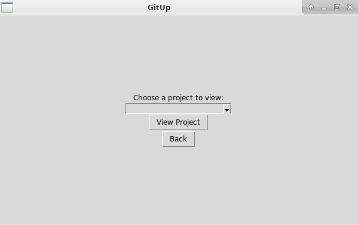

Click on the combobox to select a project to view:

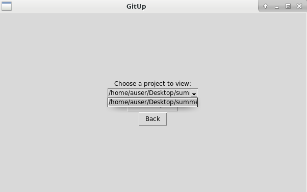

You'll then be brought to this screen:

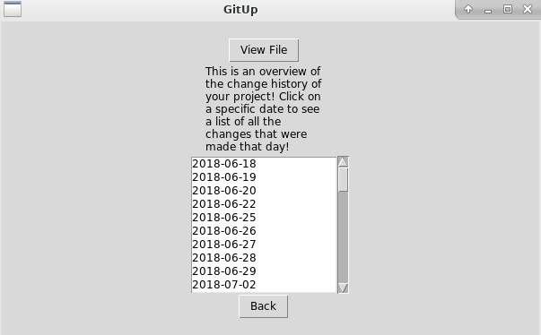

This list is a big picture view of all the changes you've made to your project. If you click on a date, you can see all the changes you've made to your project that day:

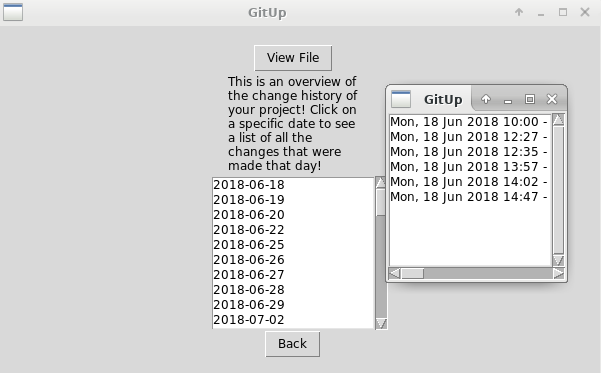

If you want to look in depth at the changes you made to a specific file, simply click 'View File'. Then, you'll be prompted to select a file:

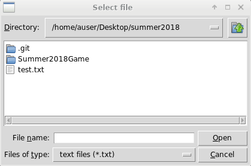

Once you've selected a file, you'll be greeted by the following screen:

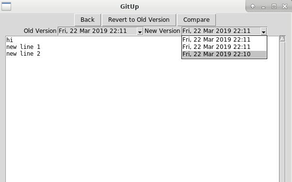

You can select an old and new version to compare with one another. If you select the same version for both, then it will just display that version of the file. However, if you select different versions, you'll get something like the following:

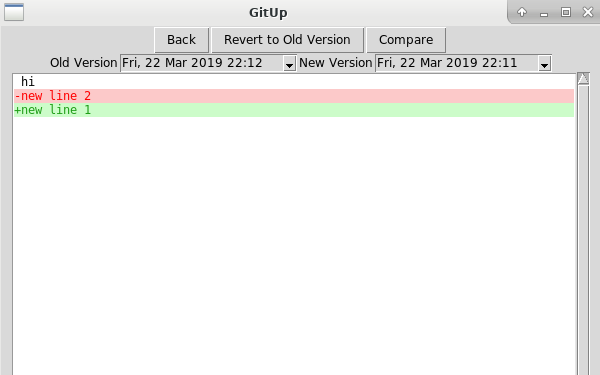

Black text is the same between both versions, red text is text that is only in the old version, and green text is text that is only in the new version. If you ever want to revert the back to a previous version, simply click on 'Revert to Pre', and the file will be reverted to whatever version you selected as your Old Version.

# Deleting a Project

You cannot delete project files through GitUp. However, you can stop tracking a project through GitUp, at which point any further changes you make to the project's files won't be backed up. To stop tracking a file, simply click on 'Stop Tracking Project' Then,
you'll be greeted by the following window:

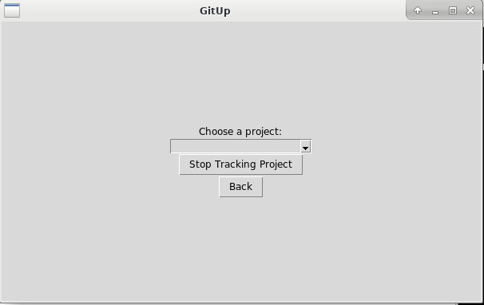

To delete a project, simply open up the dropdown list. Then, similarly to viewing a project, simply select the project you want to stop tracking. Hit 'Stop Tracking Project', and GitUp will no longer track the project you've selected!

# Merge Conflicts

Since GitUp automatically syncs versions of files, sometimes a file is changed at the same time by two different machines. When that happens, something called a 'merge conflict' occurs. When a merge conflict occurs for a file, GitUp will replace that file with a special conflict file for all versions of the project. The conflict file will look something like this:

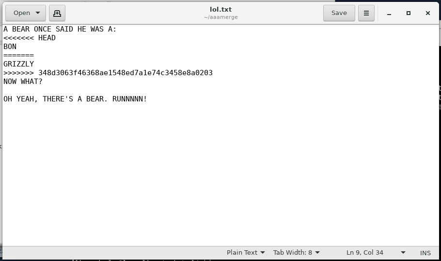

All parts of the file where both versions of the file were the same just appear as normal text. However, there will be one
or more special 'conflict' regions where each version of the file was different. The conflict regions will be separated from the rest of the file and will be in the format

<<<<<<< HEAD

This is

Version 1

\=\=\=\=\=\=\=\=

This is Version

2

\>\>\>\>\>\>\> \#RandomStringOfLettersAndNumbers

The conflict region is bounded off from regular parts of the file through <s and >s. The acutal two conflicting versions of the conflict region are separated by a string of =s. To fix the merge conflict, simply open the file on one version of the project, and edit it and save. The changes will be automatically reflected in all versions of the file, and you can proceed as normal!

# Important Notes

Since the projects are on your GitHub account, you can modify your project using git. However, we strongly discourage doing this, as GitUp will handle all aspects of backing up your work and viewing/reverting past versions for you. Also, be careful about making changes to the same file in a project on multiple machines simultaneously or when you don't have access to the internet. Doing so could cause a merge conflict, which you will have to manually resolve.

## Building from Source

Requirements:
The only operating system GitUp currently supports is Linux. On top of this, your system will need to have Python version 3.7 installed: [https://www.python.org/downloads/release/python-372/](https://www.python.org/downloads/release/python-372/).

To build from source, first clone our git repository from [https://github.com/gerar231/GitUp](https://github.com/gerar231/GitUp) using "git clone https://github.com/gerar231/GitUp". The second step is to download PyBuilder, which we use to build our project. You can run "sudo python3.7 -m pip install -U --pre pybuilder" from the terminal to download this. Next, navigate into the repository from the terminal. After navigating to the repository, first run the command "sudo pyb install_dependencies", followed by "sudo pyb". 

To run GitUp, navigate from the top level of the repository to /src/main/python/ and then run "python3.7 GitUp.py".

## Projects that helped us:

[TKinter](https://docs.python.org/3/library/tk.html) 

[GitPython](https://gitpython.readthedocs.io/en/stable/)

[PyGithub](https://pygithub.readthedocs.io/en/latest/index.html) 

[Inotify](http://man7.org/linux/man-pages/man7/inotify.7.html)
